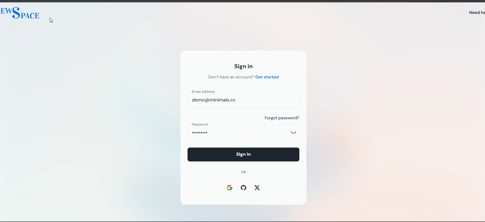
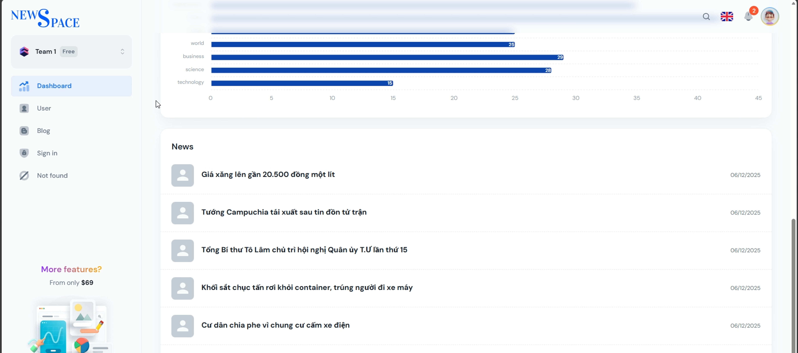
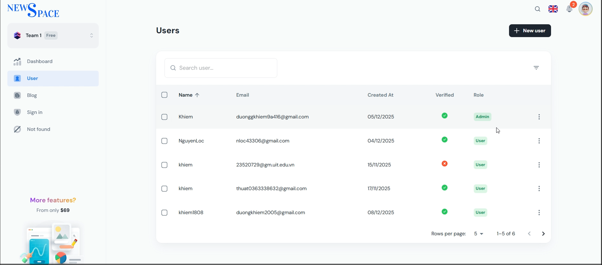

## Web Admin NewsSpace (From Minimal UI) 

> React Admin Dashboard made with Material-UI components and React + Vite.js.

> Đăng nhập.

> Dashboard

> Users

## Mô Tả

- Đây là Web Admin dành cho ứng dụng báo điện tử NewsSpace, trang Web giúp quản trị viên có thể thống kê một cách trực quan (số lượng bài báo, lượng người dùng, blogs) cũng như chỉnh sửa về các tài khoản của user.

## Cách dùng

- Clone the repo: ``
- Yêu cầu: `Node.js v20.x`
- **Install:** `npm i` or `yarn install`
- **Start:** `npm run dev` or `yarn dev`
- **Build:** `npm run build` or `yarn build`
- Open browser: `http://localhost:3039`
